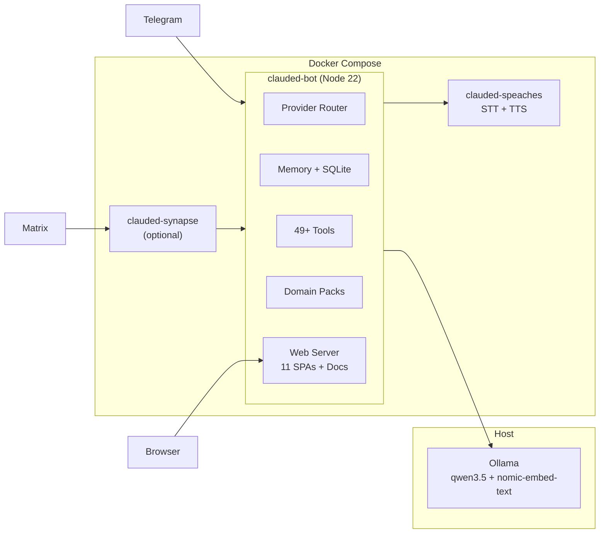

# clauded

A personal AI assistant daemon that bridges messaging platforms to AI backends running on your machine. Docker-containerized with local voice processing, persistent memory, scheduled tasks, a learning coach, and a full suite of manufacturing engineering tools. Extensible with Domain Packs for any department.

**New here?** Start with the [Department Onboarding Runbook](docs/deployment-runbook.md) — a 30-minute step-by-step guide to get your own instance running.

---

## Features

**AI Providers**
- Claude (via CLI subprocess, subscription-based) or Ollama (local, no subscription needed)
- 49+ builtin tools (web search, file reading, document generation, GitHub, manufacturing)
- Automatic provider routing per-message

**Messaging**
- Telegram (grammy) — primary interface
- Matrix (self-hosted Synapse, optional)
- Voice web chat (browser-based, WebSocket)

**Voice** (fully local, no cloud transcription)
- STT: Faster-whisper via Speaches (99 languages, auto-detect)
- TTS: Kokoro-82M via Speaches (English + Spanish)

**Memory**
- Dual-layer: semantic (long-term facts) + episodic (conversation events)
- AI-powered episode compression with salience decay
- Hybrid search: FTS5 + vector embeddings (sqlite-vec)

**Skills & Tools**
- 5 builtin skills with auto-triggering (debugger, careful, brainstormer, analyst, coder)
- Tool Forge: create, upload, auto-generate, and manage custom tools
- Safety scanning for user-created tools

**Domain Packs** (department customization)
- Bundled tools + skills + templates + AI context per department
- Three customization levels: Simple (5 min), Domain Pack (1-2 hrs), TypeScript Module (1-2 days)
- Finance example pack included with NPV calculator and budget variance tools
- `/pack create` scaffolds new department packs

**Productivity**
- Kanban board with conversational task creation
- Cron-based scheduling and reminders
- Proactive messaging (follow-ups, daily/weekly digests)
- Document generation (XLSX, DOCX, PDF, PPTX, CSV) with charts

**Learning**
- Structured learning plans with topic hierarchies
- Micro-sessions using Socratic method
- Spaced repetition with 4-level mastery tracking
- 12 teaching personas

**Manufacturing Engineering** (15 modules, 11 web dashboards)
- Production simulation (DES, Monte Carlo, MiniZinc optimization)
- Capacity planning (12-step analysis, ROI, what-if scenarios)
- Job sequencing (6 dispatching rules, genetic algorithm)
- Six Sigma, Line balancing, Inventory planning
- SPC / Control Plans, FMEA, Root Cause Analysis
- DOE, Value Stream Mapping, Theory of Constraints
- CONWIP / Heijunka, State Machine simulator (PLC export)

**Research & DevOps**
- Academic paper search (Semantic Scholar + arXiv) with citation management
- GitHub integration (repos, issues, PRs, commits)
- Render monitoring (services, deploys, logs)

**Security**
- Docker container isolation with non-root user
- Token-authenticated web UI and API endpoints
- SSRF protection on all URL-fetching tools
- Prompt injection framing on untrusted content (memory, web search, files)
- Log sanitization (credentials redacted from ring buffer)
- 20 threat vectors assessed — see [Security Model](docs/security.md)

## Quick Start

### For Department Teams (E2E Testing)

Follow the [Department Onboarding Runbook](docs/deployment-runbook.md) — 30 minutes from clone to working bot.

### For Developers

**Prerequisites:**
- Docker Desktop >= 24.0
- Ollama >= 0.5.0 running on the host
- Telegram bot token (from [@BotFather](https://t.me/BotFather))
- Claude subscription (optional — set `AI_PROVIDER=ollama` to use Ollama only)

```bash
git clone https://github.com/ccmanuelf/superprompt.git
cd superprompt
cp .env.example .env       # Edit with your tokens — every variable is documented
ollama pull qwen3.5:latest
ollama pull nomic-embed-text
docker compose up -d
```

Send `/start` to your Telegram bot. Send `/help` for all commands.

**Enable Web UI** (dashboards, docs, voice chat):
```bash
# Generate a secure token and add both lines to .env:
# VOICE_WEB_PORT=3030
# VOICE_WEB_TOKEN=$(openssl rand -hex 32)
# Then restart:
docker compose restart clauded
```

Access at `http://localhost:3030/`. Documentation at `http://localhost:3030/docs`.

## Architecture



## Documentation

| Document | Description |
|----------|-------------|
| [Department Runbook](docs/deployment-runbook.md) | **Start here** — 30-minute onboarding checklist |
| [User Guide](docs/user-guide.md) | Complete feature guide, configuration scope, env var reference |
| [Command Reference](docs/commands.md) | All 39+ Telegram/Matrix commands, web UIs, Ollama tools |
| [Customization Guide](docs/customization-guide.md) | 3-level guide for extending clauded per department |
| [Deployment Guide](docs/deployment-guide.md) | Workstation, local server, VPS, InMotion, Oracle Cloud |
| [Architecture](docs/architecture.md) | Internal design with Mermaid diagrams |
| [Security Model](docs/security.md) | 20 threat vectors assessed, mitigations, config checklist |
| [Decisions](reference/decisions.md) | Confirmed architectural decisions |
| [Voice Setup](reference/voice-local.md) | Speaches/Kokoro/Faster-whisper details |
| [Ollama Tools](reference/ollama-tools.md) | Tool definitions and agentic loop |
| [Matrix Setup](reference/matrix-setup.md) | Synapse deployment and bot SDK |

All documentation is also available in-browser at `http://localhost:3030/docs` (7 tabs with Mermaid diagram rendering).

## Tech Stack

| Component | Technology |
|-----------|-----------|
| Runtime | Node.js 22 (ESM, TypeScript ES2022) |
| AI | Claude CLI + Ollama (qwen3.5) |
| Messaging | grammy (Telegram) + matrix-bot-sdk (Matrix) |
| Voice | Speaches (Faster-whisper + Kokoro-82M) |
| Database | SQLite (WAL) + FTS5 + sqlite-vec |
| Web | Express + WebSocket + Vue 3/Vuetify (CDN) |
| Charts | Chart.js + chartjs-node-canvas |
| Documents | ExcelJS, docx, pdfkit, pptxgenjs |
| Container | Docker Compose (3 services) |
| Logging | pino + pino-pretty |

## Commands

39+ commands available. See [docs/commands.md](docs/commands.md) for the full reference, or type `/help` in the bot.

| Category | Key Commands |
|----------|-------------|
| Packs | `/pack list/info/create/templates` |
| Provider | `/claude`, `/ollama`, `/auto`, `/provider` |
| Voice | `/voice`, send voice messages |
| Memory | `/memory` |
| Skills | `/skill list/use/create/off`, `/careful` |
| Tools | `/tool list/show/upload/generate` |
| Tasks | `/schedule create/list`, `/board view/move` |
| Learning | `/learn plan/session/status` |
| Research | `/research`, `/cite` |
| Manufacturing | `/sim`, `/capacity`, `/sequence`, `/sigma`, `/balance`, `/inventory`, `/spc`, `/fmea`, `/rca`, `/doe`, `/vsm`, `/toc`, `/conwip`, `/fsm` |
| Digests | `/digest daily/weekly/now/off` |
| Help | `/help` — categorized command reference |

## Tests

```bash
npm test           # Run all tests (vitest)
npm run test:watch # Watch mode
npm run typecheck  # TypeScript type checking
```

1469 tests across 60 files covering domain packs, manufacturing modules, memory system, tools, and utilities.

## E2E Testing

93 end-to-end test cases in [scripts/e2e-test.md](scripts/e2e-test.md) covering:
- Core features (messaging, voice, memory, skills, tools)
- S9 additions (packs, /help, /docs, API auth, CORS, SSRF, prompt injection framing)
- Department onboarding smoke test

## License

Private project. All rights reserved.
