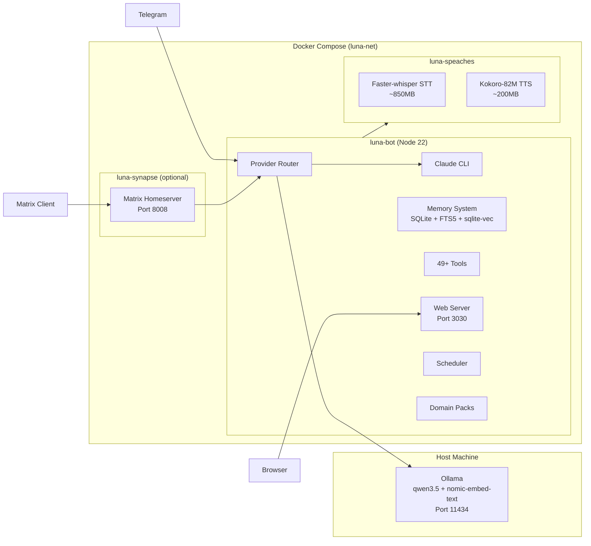
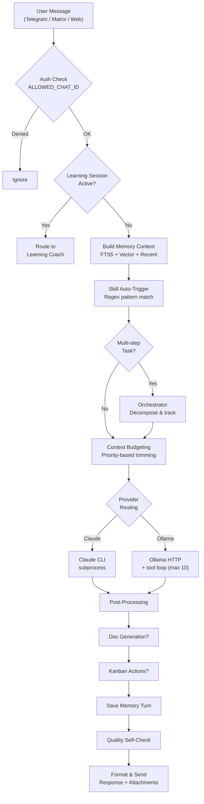
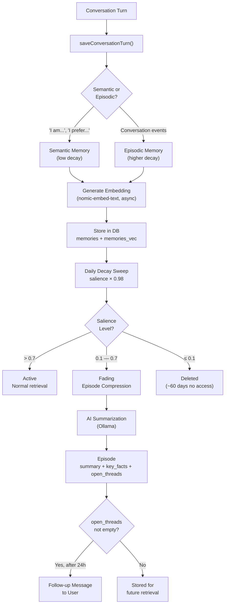
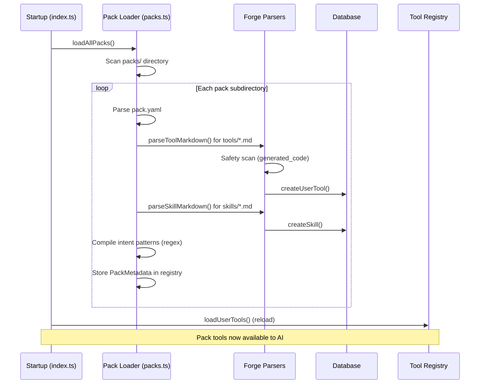
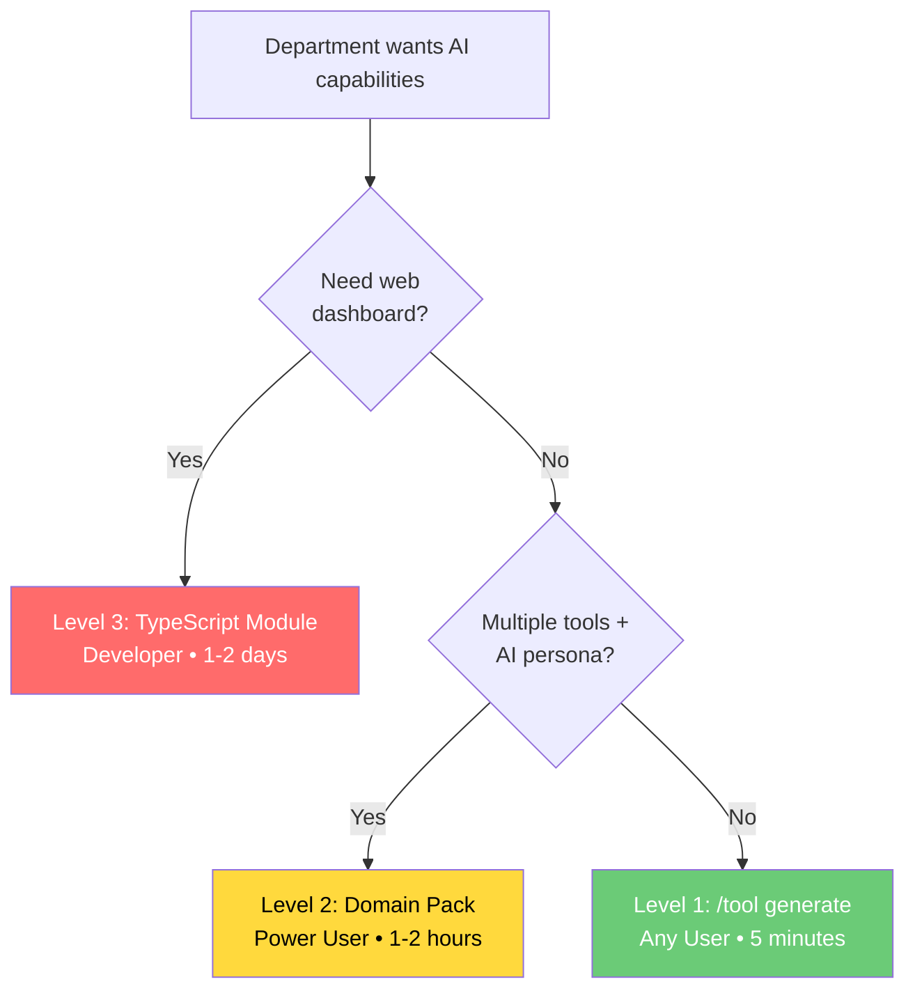
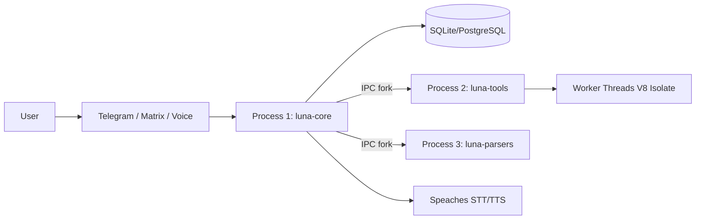
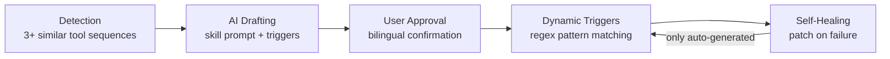

# Luna — Architecture Guide

Internal architecture reference for developers and contributors.

**Version:** v1.0.0-rc.95 — last refreshed 2026-04-27.
**Test coverage at this revision:** 2,367 tests across 107 files. 181 .ts files in `src/`.
**Active workstreams:** attendance reconciliation pilot (Phase A almost complete, Phase B engine landed in rc.94 awaiting wiring) and NovaLink bridge integration (PLANNED — see [`NOVALINK_BRIDGE_INTEGRATION.md`](./NOVALINK_BRIDGE_INTEGRATION.md)).

---

## Table of Contents

1. [System Overview](#system-overview)
2. [Docker Deployment](#docker-deployment)
3. [Startup Sequence](#startup-sequence)
4. [Message Processing Flow](#message-processing-flow)
5. [Provider Routing](#provider-routing)
6. [Memory Lifecycle](#memory-lifecycle)
7. [Episode Compression](#episode-compression)
8. [Context Budgeting](#context-budgeting)
9. [Tool System](#tool-system)
10. [Skill System](#skill-system)
11. [Forge (Dynamic Tool/Skill Management)](#forge)
12. [Voice Pipeline](#voice-pipeline)
13. [Proactive Messaging](#proactive-messaging)
14. [Orchestrator](#orchestrator)
15. [Learning System](#learning-system)
16. [Manufacturing Modules](#manufacturing-modules)
17. [Web Server](#web-server)
18. [Database Schema](#database-schema)
19. [Domain Pack System](#domain-pack-system)
20. [Security Model](#security-model)
21. [3-Process Architecture](#3-process-architecture)
22. [Tool Execution Pipeline](#tool-execution-pipeline)
23. [Auto-Skills Lifecycle](#auto-skills-lifecycle)
24. [Pack System Architecture](#pack-system-architecture)

---

## System Overview



### Key Design Principles

- **Graceful degradation**: If a service is down, log and continue — never crash
- **Local-first by default (rc.95)**: `AI_PROVIDER=ollama` and `AUTO_ROUTE=true` are the shipped defaults. Routine turns run on the host's Ollama; Claude is the escalation path for long-form / document-generation turns. Claude itself uses a flat-rate Anthropic subscription via the `claude` CLI subprocess — **no per-call cost**, but rate-limit headroom is finite, which is why local-first is the posture even though it isn't a billing concern.
- **Voice, memory, search, and tools run locally**: Speaches sidecar (STT/TTS), SQLite + sqlite-vec (memory), SearXNG (web search). The only outbound network calls in default operation are to Anthropic (Claude path) and to Brave Search if configured as a web-search fallback.
- **Docker-sandboxed**: Claude CLI runs with `--dangerously-skip-permissions` safely inside container isolation
- **Secrets via environment**: All credentials in `.env` (gitignored), never hardcoded. Rotation procedures in [`security.md`](./security.md).
- **Usage observability (rc.95)**: `/usage` slash command exposes per-provider call counts for the current month. `api_usage` table populated fire-and-forget at the user-turn level. Honest framing — counts only, no synthetic "savings" math, since the subscription is flat-rate.

---

## Docker Deployment

### Container Architecture

| Container | Image | Purpose | Network Access | Status |
|-----------|-------|---------|---------------|--------|
| `luna-bot` | `node:22-slim` (custom) | Main application | Internal + port 3030 (localhost) | shipped |
| `luna-speaches` | `ghcr.io/speaches-ai/speaches:latest-cpu` | Voice STT/TTS | Internal only | shipped |
| `luna-searxng` | `searxng/searxng:latest` | Web search (Ollama) | Internal only | shipped |
| `luna-caddy` | `caddy:2-alpine` | Reverse proxy + HTTPS (production profile) | Ports 80, 443 | shipped |
| `luna-synapse` | `matrixdotorg/synapse:latest` | Matrix homeserver (optional) | Internal + port 8008 (localhost) | shipped |
| `novalink-bridge` | `ccmanuelf/novalink-bridge` (TBD) | Data access for NovaLink BOM/parts/inventory; SQL-over-HTTP + typed REST | Internal only (no host port publish) | **PLANNED** — runs as Replit prototype today |
| `novalink-postgres` | `postgres:16-alpine` | Bridge metadata DB (replaces Neon serverless) | Internal only | **PLANNED** |

**Note on PLANNED containers:** the NovaLink bridge and its metadata DB are not yet part of `docker-compose.yml`. They are documented here because they are the immediate next deployment increment — see [`NOVALINK_BRIDGE_INTEGRATION.md`](./NOVALINK_BRIDGE_INTEGRATION.md) for the full target architecture, migration plan, and Luna-side adapter spec. Other deployments (non-NovaLink) will not include these services.

### Build Stages (luna.dockerfile)

**Builder stage** (node:22-slim):
1. Install native module build deps (python3, make, g++, cairo, pango)
2. `npm ci` with native compilation (better-sqlite3, canvas)
3. TypeScript compilation (`npm run build`)

**Production stage** (node:22-slim):
1. Install runtime deps: curl, git, chromium (puppeteer), minizinc, claude-code CLI, gh CLI
2. Copy compiled `dist/` and `node_modules/` from builder
3. Copy static web assets to `dist/web/public/`
4. Create non-root `luna:luna` user
5. Entrypoint: `/entrypoint.sh` → `node dist/index.js`

### Entrypoint Script (docker/entrypoint.sh)

1. Ensure Claude CLI onboarding flag (`~/.claude.json`)
2. Clean stale PID file from previous runs
3. Background: Wait for Speaches → load STT/TTS models via POST API
4. Background: Wait for Ollama → pull `nomic-embed-text` model
5. Exec: `node dist/index.js`

### Networking

All containers share `luna-net` (bridge network). The bot reaches:
- Speaches at `http://speaches:8000`
- SearXNG at `http://searxng:8080`
- Synapse at `http://synapse:8008`
- Ollama at `http://host.docker.internal:11434` (host machine, NOT in Docker)
- NovaLink bridge at `http://novalink-bridge:5000` *(PLANNED — once the bridge sidecar lands)*

### Port map

| Port | Where exposed | Service | Purpose |
|------|---------------|---------|---------|
| 3030 | `127.0.0.1:3030` (host) | `luna-bot` | Web UI (voice chat, kanban, learning, manufacturing dashboards, attendance admin) |
| 80, 443 | host (production profile) | `luna-caddy` | Reverse proxy with automatic Let's Encrypt TLS |
| 8000 | internal only | `luna-speaches` | OpenAI-compatible STT + TTS |
| 8008 | `127.0.0.1:8008` (host) | `luna-synapse` | Matrix homeserver (optional) |
| 8080 | internal only | `luna-searxng` | Self-hosted metasearch |
| 11434 | host (NOT containerized) | Ollama | Reached via `host.docker.internal:11434` |
| 5000 | internal only (PLANNED) | `novalink-bridge` | Data access for NovaLink |
| 5432 | internal only (PLANNED) | `novalink-postgres` | Bridge metadata DB |

### Environment variables (rc.95 reference)

The complete authoritative inventory lives in [`.env.example`](../.env.example). Most-touched at deploy time:

| Variable | Required? | Default | Purpose |
|----------|-----------|---------|---------|
| `AI_PROVIDER` | yes | `ollama` (rc.95) | Default provider when auto-routing is off or sticky |
| `AUTO_ROUTE` | yes | `true` (rc.95) | Engages `classifyMessage()` to pick provider per turn |
| `TELEGRAM_BOT_TOKEN` | yes | — | From [@BotFather](https://t.me/BotFather) |
| `ALLOWED_CHAT_ID` | recommended | empty | Comma-separated chat IDs allowed to message the bot. Empty = open. **Note:** `/attendance` commands bypass this gate (per-subcommand role checks are authoritative since rc.92) |
| `CLAUDE_CODE_OAUTH_TOKEN` | optional | — | Generated via `claude setup-token`. If empty, the Claude path is unavailable; Ollama still works |
| `OLLAMA_HOST` | yes | `http://localhost:11434` | Inside Docker, set to `http://host.docker.internal:11434` |
| `OLLAMA_CHAT_MODEL` | yes | `qwen3.5:latest` | Used for chat-only turns |
| `OLLAMA_TOOL_MODEL` | yes | `qwen3.5:latest` | Used for tool-calling turns |
| `OLLAMA_EMBED_MODEL` | yes | `nomic-embed-text` | Used for memory vector search |
| `SPEACHES_URL` | yes | `http://localhost:8000/v1` | Inside Docker, `http://speaches:8000/v1` |
| `VOICE_WEB_PORT` | optional | 0 | Set to 3030 to enable the web UI |
| `BRAVE_API_KEY` | optional | — | Web search fallback for Ollama if SearXNG isn't enough |
| `GH_TOKEN` | optional | — | GitHub-integration tools |
| `LOG_LEVEL` | optional | `info` | pino log level |
| `NOVALINK_BRIDGE_URL` | **PLANNED** | `http://novalink-bridge:5000` | Set when the `packs/novalink/` pack lands |
| `NOVALINK_BRIDGE_API_KEY` | **PLANNED** | — | Generated by bridge admin |
| `NOVALINK_SQL_ALLOWED_ROLES` | **PLANNED** | `admin` | Comma-separated roles allowed to call `/novalink-sql` |

### Volumes

| Volume/Bind | Mount Point | Purpose |
|-------------|------------|---------|
| `./store` | `/app/store` | SQLite DB, persistent data |
| `./workspace` | `/app/workspace` | Uploads, generated docs, repos, screenshots |
| `./.env` | `/app/.env:ro` | Environment config (read-only) |
| `docker/.env.docker` | `/app/.env.docker:ro` | Docker overrides (read-only) |
| `speaches-models` | `/root/.cache` | Cached STT/TTS model weights |
| `synapse-data` | `/data` | Matrix homeserver state |

---

## Startup Sequence

**Source**: `src/index.ts`

```
1. Show banner (banner.txt)
2. Validate configuration (src/config.ts)
3. Acquire PID lock (store/luna.pid)
4. Initialize SQLite database (WAL mode, FTS5, sqlite-vec)
5. Register 49+ builtin tools
6. Load user tools from database
7. Auto-import tools/skills from forge/ directory
8. Check for unembedded memories → generate embeddings
9. Run memory salience decay + schedule 24h recurring
10. Clean up stale uploads from workspace/
11. Initialize ProviderRouter (Claude + Ollama)
12. Start Telegram bot (if TELEGRAM_BOT_TOKEN configured)
13. Start Matrix bot (if MATRIX_ACCESS_TOKEN configured)
14. Start web server (if VOICE_WEB_PORT configured)
15. Initialize cron scheduler
16. Initialize proactive messaging (follow-ups + digests)
17. Initialize learning session cleanup
18. Register signal handlers (SIGTERM, SIGINT → graceful shutdown)
19. Start polling / syncing
```

---

## Message Processing Flow



---

## Provider Routing

**Source**: `src/providers/router.ts`

### Architecture

```typescript
interface AIProvider {
  chat(messages: ChatMessage[], systemPrompt?: string): Promise<AIResponse>;
}
```

Two implementations:
- `ClaudeProvider` (`src/providers/claude.ts`): Spawns `claude -p` subprocess, parses streaming JSON
- `OllamaProvider` (`src/providers/ollama.ts`): HTTP to local Ollama, manages tool iteration loop

### Auto-Routing Logic

When `AUTO_ROUTE=true`, the router analyzes each message:

1. **Tool indicators**: Action verbs (search, read, check, find, get, look up, fetch, save, remember) + tool-related nouns → Ollama
2. **Explicit tool requests**: "use web search", "check the file" → Ollama
3. **Complex reasoning**: Long-form, creative, nuanced → Claude
4. **Default**: Falls back to `AI_PROVIDER` setting

### Session Management

- **Claude**: Supports `--resume` flag for multi-turn sessions
- **Ollama**: In-memory conversation history per chat (max 20 turns / 40 messages)

### System Prompt Injection

The router assembles the system prompt from multiple components:

```
[System Prompt (LUNA.md)]
[Capabilities Prompt (src/capabilities.ts)]
[Quality Rules]
[Command List]
[Active Skill Prompt (if any)]
[Memory Context]
[Chat History]
```

---

## Memory Lifecycle

**Source**: `src/memory.ts`, `src/db.ts`, `src/embeddings.ts`

### Storage

```sql
CREATE TABLE memories (
  id INTEGER PRIMARY KEY,
  chat_id TEXT NOT NULL,
  content TEXT NOT NULL,
  sector TEXT NOT NULL,        -- 'semantic' or 'episodic'
  created_at INTEGER NOT NULL,
  accessed_at INTEGER NOT NULL,
  salience REAL DEFAULT 1.0    -- 0.0 to 5.0
);
-- + memories_fts (FTS5 virtual table)
-- + memories_vec (sqlite-vec 768-dim embeddings)
```

### Write Path

1. After each AI response, `saveConversationTurn()` is called
2. Content is classified as semantic or episodic by pattern matching
3. Memory is inserted into `memories` table
4. Embedding is generated asynchronously via Ollama `nomic-embed-text`
5. Embedding stored in `memories_vec` for vector search

### Read Path (buildMemoryContext)

1. **FTS5 search**: Top 3 memories + 2 episodes matching user query keywords
2. **Vector search**: Top 3 memories + 2 episodes by cosine similarity to query embedding
3. **Recency**: Top 5 most recently accessed memories
4. **Merge**: Deduplicate across all three result sets
5. **Touch**: Bump `accessed_at` and salience (+0.1, capped at 5.0) for accessed memories
6. **Format**: Render as markdown block prepended to the user's message

### Memory Lifecycle Diagram



### Salience Decay

Runs on startup + every 24 hours:

```
new_salience = current_salience × 0.98  (2% daily decay)
```

| Threshold | Action |
|-----------|--------|
| salience > 0.7 | Active — normal retrieval |
| 0.1 < salience ≤ 0.7 | Fading — eligible for episode compression |
| salience ≤ 0.1 | Deleted — no longer relevant (~60 days of no access) |

---

## Episode Compression

**Source**: `src/memory.ts`

### Trigger

Memories with salience between 0.1 and 0.7 (fading but potentially valuable).

### Process

1. **Group**: Cluster eligible memories by time proximity (1-hour window)
2. **Compress**: Send each group to Ollama for AI summarization
3. **Extract**: AI returns structured JSON:
   ```json
   {
     "summary": "One paragraph, max 200 words",
     "key_facts": ["Actionable fact 1", "Actionable fact 2"],
     "open_threads": ["Unresolved topic 1"]
   }
   ```
4. **Store**: Save as episode in `episodes` table with vector embedding
5. **Delete**: Remove original source memories (replaced by episode)

### Compression Prompt

Uses Filtration Analysis framework (inspired by Slate):
- **Relevance filter**: Is this information useful for future context?
- **Outcome filter**: Does this capture a decision or result?
- **Continuity filter**: Does this connect to ongoing threads?

Excludes greetings, small talk, and trivial exchanges.

### Failure Safety

If Ollama is unavailable during compression:
- Eligible memories are protected by boosting their salience
- Compression is retried in the next 24h cycle
- No memories are lost

---

## Context Budgeting

**Source**: `src/context-budget.ts`

### Purpose

Ollama has a fixed context window (default: 32,768 tokens). Context budgeting ensures the most important information fits.

### System Prompt Composition

```mermaid
flowchart LR
    subgraph Components
        A["System Prompt<br/>(LUNA.md)"]
        B["Capabilities<br/>(base + pack)"]
        C["Active Skill"]
        D["Quality Rules"]
        E["Command List"]
        F["Context Hint<br/>(per-message)"]
        G["Memory Context"]
        H["Chat History"]
    end

    subgraph Budget["Context Budget (32K tokens)"]
        direction TB
        P100["P100: System (never trimmed)"]
        P90["P90: User Message"]
        P80["P80: Skill"]
        P70["P70: Quality Rules"]
        P50["P50: Semantic Memories"]
        P45["P45: Episodes"]
        P40["P40: Episodic Memories"]
        P30["P30: Recent History"]
        P10["P10: Old History (trimmed first)"]
    end

    Components --> Budget
    Budget --> Send["Send to Provider"]
```



### Token Estimation

Heuristic: ~4 characters per token. Fast, no API call needed.

### Priority Hierarchy

| Priority | Component | Trimmable? |
|----------|-----------|-----------|
| 100 | System prompt | No |
| 90 | Current user message | No |
| 80 | Active skill prompt | Yes (removed entirely) |
| 70 | Quality rules + command list | Yes |
| 60 | Document generation capabilities | Yes |
| 50 | Semantic memories | Yes (reduced) |
| 45 | Episode summaries | Yes (reduced 50%) |
| 40 | Episodic memories | Yes (reduced 50%) |
| 30 | Recent chat history | Yes (kept at 1/3) |
| 10 | Older chat history | Yes (removed first) |

### Trimming Strategy

When assembled context exceeds budget:
1. Remove oldest history entirely
2. Reduce recent history to 1/3
3. Reduce episodic memories by 50%
4. Remove episodes
5. Remove quality rules
6. Last resort: remove skill prompt

Output reserve: 2,048 tokens held back for the AI's response.

---

## Tool System

**Source**: `src/providers/tools/`

### Architecture

Tools are functions available to the Ollama provider during its agentic loop. Each tool has:

```typescript
interface ToolDefinition {
  name: string;
  description: string;
  parameters: JSONSchema;
  execute: (params: Record<string, unknown>) => Promise<unknown>;
}
```

### Builtin Tools (49+)

Registered in `src/providers/tools/index.ts`:

| Category | Tools |
|----------|-------|
| System | `get_time`, `system_info`, `run_command`, `read_file`, `read_bot_logs` |
| Web | `web_search`, `summarize_url`, `take_screenshot` |
| Memory | `query_memory`, `save_memory` |
| Files | `parse_file`, `generate_document` |
| GitHub | `github_list_repos`, `github_read_file`, `github_list_issues`, `github_list_prs`, `github_clone_repo`, `github_diff`, `github_commit_push`, `github_create_pr` |
| Render | `render_list_services`, `render_deploy_status`, `render_get_logs` |
| Tasks | `kanban_manage`, `create_reminder`, `search_papers` |
| Manufacturing | 15 tools (capacity, simulation, sequencer, sigma, balance, inventory, spc, fmea, rca, doe, vsm, toc, conwip, fsm, minizinc) |

### Agentic Loop (Ollama)

```
User message → Ollama (with tool definitions)
      │
      ▼
Ollama returns tool_calls? ──No──► Return text response
      │
      Yes
      │
      ▼
Execute each tool call
      │
      ▼
Send tool results back to Ollama
      │
      ▼
Repeat (max 10 iterations)
      │
      ▼
Return final text response
```

### Tool Error Handling

- Tools return `{ error: "description" }` on failure (never throw)
- Failed tools don't break the loop — the AI sees the error and adapts
- Command execution has a 10-second timeout
- File reading has a 10,000-character limit with truncation notice

---

## Skill System

**Source**: `src/skills.ts`

### How Skills Work

A skill injects a specialized system prompt that modifies the AI's behavior for the current chat.

### Auto-Triggering

Each builtin skill has trigger patterns (regex). On every message:

1. Check message against all skill trigger patterns
2. If match found and no skill already active:
   - `auto` trigger type: Activate automatically
   - `suggest` trigger type: Suggest to user (not forced)
3. Some skills have `turns_left` — auto-deactivate after N turns

### Skill Storage

```sql
CREATE TABLE skills (
  id INTEGER PRIMARY KEY,
  name TEXT UNIQUE NOT NULL,
  description TEXT,
  system_prompt TEXT NOT NULL,
  allowed_tools TEXT,       -- JSON array of tool names (null = all)
  is_locked INTEGER DEFAULT 0,
  created_at INTEGER
);
```

---

## Forge

**Source**: `src/forge/`

### Components

| File | Purpose |
|------|---------|
| `tool-registry.ts` | Dynamic tool registration and execution |
| `tool-parser.ts` | Parse Markdown → tool definition |
| `tool-generator.ts` | AI-powered tool code generation |
| `tool-fixer.ts` | AI-powered tool repair |
| `skill-parser.ts` | Parse Markdown → skill definition |
| `skill-fixer.ts` | AI-powered skill repair |
| `safety-scanner.ts` | Security scanning of tool code |
| `exporter.ts` | Export tools/skills to Markdown |
| `auto-import.ts` | Discover tools/skills from `forge/` directory |
| `declarative-http.ts` | Declarative HTTP tool definitions |
| `bridges.ts` | Cross-tool bridges (FSM ↔ other modules) |

### Auto-Import

On startup, `forge/tools/*.md` and `forge/skills/*.md` are scanned, parsed, and registered. This allows distributing tools/skills as files.

### Safety Scanner

Before registering user tools, code is scanned for:
- File system access outside `OLLAMA_ALLOWED_PATHS`
- Unauthorized network requests
- Shell injection patterns
- Environment variable reads
- Infinite loops or resource exhaustion patterns

---

## Voice Pipeline

**Source**: `src/voice.ts`

### STT Flow (Speech-to-Text)

```
Audio file (.oga from Telegram)
    │
    ▼
Rename .oga → .ogg (same Opus codec, Whisper needs .ogg)
    │
    ▼
POST to Speaches API /v1/audio/transcriptions
    │  (model: Systran/faster-whisper-small)
    │  (no language param → auto-detect 99 languages)
    │
    ▼
Returns: { text, language }
```

### TTS Flow (Text-to-Speech)

```
AI response text
    │
    ▼
Detect language (STT hint > franc-min > default English)
    │
    ▼
Select voice: af_heart (EN) / ef_dora (ES)
    │
    ▼
POST to Speaches API /v1/audio/speech
    │  (model: speaches-ai/Kokoro-82M-v1.0-ONNX)
    │
    ▼
Returns: MP3 audio buffer → sent as voice message
```

### Platform Integration

- **Telegram**: Voice message → download .oga → transcribe → process → reply with voice + text
- **Matrix**: Audio attachment → download via mxc:// → transcribe → process → reply
- **Web**: WebSocket audio stream → transcribe → process → TTS → stream back

---

## Proactive Messaging

**Source**: `src/proactive.ts`

### Follow-Ups

1. After episode compression, `open_threads` are extracted
2. Timer checks every 1 hour for episodes older than 24 hours with unresolved threads
3. Sends formatted follow-up message to the user
4. Marks episode as followed-up in `episode_follow_ups` table

### Digests

- Per-user preference stored in `digest_preferences` table
- `daily` / `weekly` / `off`
- Compiles: conversation summaries, key facts, task updates, open threads
- Delivered via platform notification callback

### Notification Routing

```typescript
function notifyUser(chatId: string, message: string) {
  if (chatId.startsWith('!')) {
    // Matrix room ID → send via Matrix bot
  } else {
    // Telegram chat ID → send via Telegram bot
  }
}
```

---

## Orchestrator

**Source**: `src/orchestrator.ts`

Handles multi-step tasks that require decomposition, parallel execution, and event-driven automation.

### Detection

`shouldOrchestrate()` checks if a message implies multiple sequential steps (e.g., "analyze this CSV, create a report, and email the summary").

### Execution

1. Decompose task into ordered steps with dependency analysis
2. Independent steps run in parallel via `Promise.all()`
3. Each step can specify a `suggestedSkill` for pack-scoped delegation
4. Track progress and send updates
5. Handle failures gracefully (report which step failed)

### Event-Driven Triggers

The `event_triggers` table stores reactive automation rules. When `emitEvent()` is called (e.g., by a tool, scheduler, or external webhook), matching triggers fire their associated actions. This enables reactive autonomy without polling.

### Background Task Queue

Long-running tasks are submitted via `submitBackgroundTask()`. Tasks execute asynchronously in the background and notify the user upon completion, preventing conversation blocking during heavy operations.

---

## Learning System

**Source**: `src/learning/`

### Components

| File | Purpose |
|------|---------|
| `index.ts` | Orchestration, exports |
| `plan.ts` | Learning plan management (topic hierarchies) |
| `session.ts` | Micro-sessions (Socratic method, 1 question at a time) |
| `spaced-repetition.ts` | SM-2-like scheduling with 4 mastery levels |
| `personas.ts` | 12 teaching personas matched to subject + difficulty |
| `db.ts` | Database tables and CRUD |

### Session Flow

1. User starts session (`/learn session <subject>`)
2. System selects next topic based on spaced repetition schedule
3. Teaching persona is auto-selected for the subject
4. Socratic dialog: AI asks questions, user answers
5. After each answer: assess mastery, update schedule
6. Session ends after time limit or user request

---

## Manufacturing Modules

### Module Structure

Each manufacturing module follows a consistent pattern:

```
src/<module>/
├── models.ts        — TypeScript types and interfaces
├── analysis.ts      — Core calculation engine (pure functions)
├── index.ts         — DB tables, CRUD, chart generation
└── (optional)
    ├── monte-carlo.ts   — Stochastic simulation wrapper
    ├── scenarios.ts     — What-if scenario engine
    └── roi.ts           — Investment analysis
```

### Tool Integration

Each module exposes a tool in `src/providers/tools/<module>.ts` that the AI invokes during conversation.

### Web API Integration

Each module with a web dashboard has an API router in `src/web/<module>-api.ts` with RESTful endpoints.

### Cross-Module Bridges

`src/forge/bridges.ts` provides converters between modules:
- Capacity Planning → TOC (work center mapping)
- VSM → Simulation (process step → operation conversion)
- FSM → any module (state machine events)

---

## Web Server

**Source**: `src/web/server.ts`

### Architecture

Express HTTP server + WebSocket (ws) on a single port.

### Authentication

- **WebSocket**: Per-user token (64-char hex) or legacy `VOICE_WEB_TOKEN` sent in connection URL
- **HTTP API**: Per-user token or `VOICE_WEB_TOKEN` in query string or Authorization header
- **Per-user tokens**: Generated via `/webtoken create [label] [ttl]`, scoped to chat_id (isolates board, learning, memory, schedules). Max 5 per user, optional TTL (24h/7d/30d), revocation disconnects sessions.
- **Legacy fallback**: `VOICE_WEB_TOKEN` env var still accepted (shared, no per-user data isolation)
- **Rate limiting**: 3 failed auth attempts per minute per IP, hourly IP ban after 15 failures

### Security

- CSP headers on all responses (relaxed for CDN-loaded SPA libraries)
- CSWSH protection: Origin validation on WebSocket upgrade
- Non-root container user (`luna:luna`)

### Static Serving

SPAs served from `dist/web/public/`:
- `/` → `index.html` (voice chat)
- `/sim/` → `sim/index.html` (simulation)
- `/capacity/` → `capacity/index.html` (capacity planning)
- etc.

All SPAs are Vue 3 + Vuetify loaded from CDN — no build step required.

### API Routes

```
/api/sim/*          — Production simulation
/api/capacity/*     — Capacity planning
/api/sequence/*     — Job sequencer
/api/vsm/*          — Value Stream Mapping
/api/toc/*          — Theory of Constraints
/api/conwip/*       — CONWIP / Heijunka
/api/doe/*          — Design of Experiments
/api/fsm/*          — State Machine
```

---

## Database Schema

**Source**: `src/db.ts`

All database access goes through **Knex** query builder, enabling support for multiple database drivers via the `DB_DRIVER` environment variable:

| Driver | Value | Use Case |
|--------|-------|----------|
| SQLite | `DB_DRIVER=sqlite` | Development, E2E testing (default) |
| MariaDB | `DB_DRIVER=mariadb` | Production (InMotion hosting) |
| PostgreSQL | `DB_DRIVER=postgres` | Production (VMware, Render) |

Migration script: `scripts/migrate-database.ts` handles schema migration across drivers.

SQLite mode uses WAL mode with FTS5 and sqlite-vec extensions.

### Core Tables

| Table | Purpose |
|-------|---------|
| `sessions` | Per-chat state (provider, model, auto-route flag) |
| `memories` | Dual-sector facts and events (semantic/episodic) |
| `memories_fts` | FTS5 full-text search index |
| `memories_vec` | sqlite-vec 768-dim embedding vectors |
| `episodes` | Compressed memory groups |
| `episodes_fts` | FTS5 index for episodes |
| `episodes_vec` | Vector embeddings for episodes |
| `episode_follow_ups` | Follow-up tracking (prevent duplicates) |

### Task & Schedule Tables

| Table | Purpose |
|-------|---------|
| `scheduled_tasks` | Cron-based recurring tasks |
| `cards` | Kanban board cards (status, priority, assignee, due date) |

### Skill & Tool Tables

| Table | Purpose |
|-------|---------|
| `skills` | Builtin + user-created skills |
| `chat_skills` | Per-chat active skill mapping |
| `skill_revisions` | Version history for skills |
| `user_tools` | Custom tool definitions and code |
| `tool_revisions` | Version history for tools |

### Learning Tables

| Table | Purpose |
|-------|---------|
| `plans` | Learning plan metadata |
| `plan_topics` | Topics within plans (ordered) |
| `sessions` | Learning session logs |
| `assessment_results` | 4-level mastery tracking |

### Digest & Automation Tables

| Table | Purpose |
|-------|---------|
| `digest_preferences` | Per-user digest frequency (daily/weekly/off) |
| `event_triggers` | Event-driven trigger rules (event name → action) |
| `tool_audit_log` | Audit trail for every tool call (chatId, tool, action, duration, process) |

### Manufacturing Tables

Each manufacturing module creates its own tables:
- `capacity_plans`, `capacity_results`
- `seq_schedules`
- `sim_scenarios`
- `vsm_maps`
- `toc_configs`
- `conwip_configs`
- `doe_experiments`
- `fsm_machines`
- And more per module

### FTS5 Sync

FTS5 virtual tables require manual synchronization — INSERT/UPDATE/DELETE triggers maintain the index. This is a known gotcha: direct SQL modifications bypass FTS5 and require manual `INSERT INTO memories_fts(memories_fts) VALUES('rebuild')`.

---

## Domain Pack System

**Source**: `src/packs.ts`

Domain Packs allow non-engineering departments to extend Luna with custom tools, skills, and AI context.

### Pack Loading Flow



### Runtime Integration

Pack capabilities are injected at two points:
1. **System prompt**: `getAggregatedCapabilities()` appends pack descriptions after `CAPABILITIES_PROMPT`
2. **Intent scoring**: `scorePackIntent()` runs pack regex patterns alongside built-in manufacturing patterns

### Three Customization Levels



See `docs/customization-guide.md` for complete procedures at each level.

---

## Security Model

### Container Isolation

- Claude CLI runs with `--dangerously-skip-permissions` **inside Docker** — the container boundary is the sandbox
- Non-root user (`luna:luna`) inside the container
- Only `./store` (rw) and `./workspace` (rw) are mounted from host
- No access to host home directory, SSH keys, or other sensitive paths

### Authentication

- **Telegram**: `ALLOWED_CHAT_ID` whitelist (comma-separated)
- **Matrix**: `MATRIX_ALLOWED_USERS` whitelist (comma-separated)
- **Web UI**: `VOICE_WEB_TOKEN` shared secret
- **First-run mode**: If `ALLOWED_CHAT_ID` is empty, all chats are accepted (for getting your chat ID)

### Tool Sandboxing

- `read_file`: Only reads paths in `OLLAMA_ALLOWED_PATHS`
- `run_command`: Whitelist of safe commands (ls, cat, head, tail, wc, date, uptime, df, free, ps, echo, pwd, which, file, stat)
- Custom tools: Scanned by safety scanner before registration
- 10-second timeout on all tool executions

### Secret Management

- All secrets in `.env` (gitignored)
- `.env.example` contains placeholders only
- Pre-commit hook scans for leaked secrets (API keys, tokens, private keys)
- `docker/.env.docker` contains no secrets — only network overrides

### Network Security

- Ports exposed to `127.0.0.1` only (not `0.0.0.0`)
- WebSocket origin validation
- CSP headers enforced
- Matrix federation disabled (no metadata leakage)

---

## 3-Process Architecture

Luna uses OS-level process separation (SA3) to limit the blast radius of any single component compromise.



### Process Responsibilities

| Process | Role | Has DB? | Has Credentials? | Has Network? |
|---------|------|---------|-------------------|-------------|
| **P1: luna-core** | Router, memory, platforms, scheduler | Yes | Yes (all tokens) | Yes |
| **P2: luna-tools** | Network tools, compute tools, Worker sandbox | No | No | Yes (outbound only) |
| **P3: luna-parsers** | PDF, DOCX, XLSX, PPTX parsing | No | No | No |

### IPC Protocol

Processes communicate via `child_process.fork()` IPC channels. Each child receives an env whitelist — only the environment variables it needs. If a child process crashes, the parent auto-restarts it. If fork is unavailable (e.g., constrained environment), the system degrades gracefully to local in-process execution.

---

## Tool Execution Pipeline

Every tool call flows through a multi-stage pipeline before execution:

```
User Message
    │
    ▼
AI selects tool(s)
    │
    ▼
┌─────────────────────────────┐
│  Policy Engine (SA4)        │
│  ─ Classify risk level      │
│  ─ Check tool_trust table   │
│  ─ Prompt user if critical  │
│    (bilingual EN/ES)        │
└──────────┬──────────────────┘
           │ approved
           ▼
┌─────────────────────────────┐
│  Process Routing (SA3)      │
│  ─ Builtin tool → P1        │
│  ─ Network/compute → P2     │
│  ─ File parsing → P3        │
└──────────┬──────────────────┘
           │ IPC message
           ▼
┌─────────────────────────────┐
│  Worker Sandbox (SA1)       │
│  ─ User-generated tools     │
│    run in fresh Worker      │
│  ─ 64MB memory limit        │
│  ─ Adaptive timeout (30s    │
│    base, 6m ceiling)        │
│  ─ safeFetch() for network  │
└──────────┬──────────────────┘
           │ result
           ▼
Return to AI → next iteration or final response
```

### Risk Classification

| Level | Count | Behavior | Examples |
|-------|-------|----------|----------|
| Critical | 3 | User confirmation required | `run_command`, `github_commit_push`, `github_create_pr` |
| High | 16 | Logged, rate-aware | `github_clone_repo`, `render_deploy_status`, file writes |
| Medium | 19 | Standard execution | `web_search`, `summarize_url`, `save_memory` |
| Low | 5 | Fast path | `get_time`, `system_info`, `query_memory` |

### Trust Memory

When a user responds to a confirmation prompt:
- **"always" / "siempre"**: Decision persisted in `tool_trust` table — never ask again for this tool in this chat
- **"never" / "nunca"**: Tool permanently blocked for this chat
- Trust decisions are per-chat and per-tool, stored across sessions

---

## Auto-Skills Lifecycle

Auto-skills (SA2) detect repetitive tool patterns and propose reusable skills automatically.



### Detection Phase

The system monitors tool call patterns per chat. When a sequence of 3 or more tools is repeated across conversations, the AI proposes creating an auto-skill to streamline the workflow.

### Drafting Phase

The AI generates:
- A natural language system prompt (not executable code)
- Regex trigger patterns that activate the skill on matching messages
- A description and allowed tool whitelist

### User Approval

Skills are never created silently. The user receives a bilingual confirmation prompt (EN/ES) showing the proposed skill name, description, and triggers. Only explicit approval proceeds.

### Dynamic Triggers

Once approved, the skill's regex patterns are compiled and checked against every incoming message. When matched, the skill activates for that conversation turn.

### Self-Healing

If an auto-generated skill causes errors or poor responses, the self-healing mechanism patches the skill prompt. This only applies to auto-generated skills — builtin and manually-created skills are never modified.

---

## Pack System Architecture

Domain Packs extend Luna with department-specific capabilities without modifying core code.

### Pack Format Levels

| Level | Complexity | Author | Time | Contents |
|-------|-----------|--------|------|----------|
| **Level 1** | Single tool | Any user | 5 minutes | `/tool generate` — conversational tool creation |
| **Level 2** | Domain Pack | Power user | 1-2 hours | `pack.yaml` + tools/*.md + skills/*.md + templates/ |
| **Level 3** | TypeScript Module | Developer | 1-2 days | Full module with web dashboard, DB tables, API routes |

### Pack Subscription Model

Packs are enabled per-chat, not globally:

- `/pack list` — show all available packs
- `/pack enable <name>` — activate pack for current chat
- `/pack disable <name>` — deactivate pack for current chat
- Pack tools and skills only appear in chats where the pack is enabled
- Multiple packs can be active simultaneously in a single chat

### Level 2 Pack Structure

```
packs/<pack-name>/
├── pack.yaml           — metadata, description, intent patterns
├── tools/
│   ├── tool-a.md       — Markdown tool definition (code + schema)
│   └── tool-b.md
├── skills/
│   └── persona.md      — Markdown skill definition (system prompt)
└── templates/
    └── report.md       — Document generation templates
```

### Level 3 Reference: Manufacturing Pack (ClawMFG)

The manufacturing pack is the reference Level 3 implementation, containing:

- 15+ tools across capacity, simulation, sequencing, quality, and lean domains
- Web dashboards at `/sim`, `/capacity`, `/sequence`, `/vsm`, `/toc`, `/conwip`, `/doe`, `/fsm`
- DB tables per module with full CRUD
- Monte Carlo and MiniZinc optimization integration
- Cross-module bridges (Capacity to TOC, VSM to Simulation)

### Conversational Pack Builder

Users can create Level 2 packs through conversation:

1. `/pack create` — starts guided builder
2. AI asks about department, use cases, tool needs
3. Generates `pack.yaml` scaffold with intent patterns
4. User populates tools and skills via `/tool generate` and `/skill create`
5. Pack is immediately available via `/pack enable`

### Test Coverage

2003 tests across 80+ files validate all pack-loaded tools, core infrastructure, circuit breaker, rate limiting, guardrails, context health, pack tuner, Knex database layer, event triggers, background tasks, and parallel orchestration.

---

## Production Reference Architecture

Recommended deployment for InfoSec sign-off:

```
                    ┌─────────────────────────────┐
                    │       DMZ / Reverse Proxy    │
                    │   (Caddy — automatic HTTPS)  │
                    │   Port 443 → localhost:3030  │
                    │   docker/Caddyfile config    │
                    └──────────┬──────────────────┘
                               │ HTTPS
                    ┌──────────┴──────────────────┐
                    │     Docker Host (VMware)     │
                    │                              │
                    │  ┌─────────────────────┐     │
                    │  │   luna-bot        │     │
                    │  │   Process 1: Core    │     │
                    │  │   Process 2: Tools   │     │
                    │  │   Process 3: Parsers │     │
                    │  │   Port 3030 (web UI) │     │
                    │  └─────────┬───────────┘     │
                    │            │                  │
                    │  ┌─────────┴───────────┐     │
                    │  │   luna-speaches   │     │
                    │  │   STT + TTS          │     │
                    │  │   (no external access)│     │
                    │  └─────────────────────┘     │
                    │                              │
                    │  ┌─────────────────────┐     │
                    │  │   PostgreSQL / MariaDB│     │
                    │  │   (or SQLite for pilot)│    │
                    │  │   Daily backup (cron) │     │
                    │  └─────────────────────┘     │
                    └──────────────────────────────┘
                               │
                    ┌──────────┴──────────────────┐
                    │   Ollama Host (GPU optional)  │
                    │   OLLAMA_HOST=http://host:11434│
                    │   qwen3.5 + nomic-embed-text  │
                    └──────────────────────────────┘
                               │
              ┌────────────────┴────────────────────┐
              │         External Services            │
              │  Anthropic API (Claude subscription) │
              │  Telegram Bot API                    │
              │  Client APIs (Shopify, ERP — future) │
              └─────────────────────────────────────┘
```

**Key security boundaries:**
- Caddy reverse proxy terminates TLS (automatic Let's Encrypt) — internal traffic is HTTP
- Speaches has NO external network access
- Process 2 (tools) has NO database access, NO bot tokens
- Process 3 (parsers) has NO network access, NO database, NO API keys
- Ollama can run on a separate GPU host (no credentials needed, just inference)
- Database is only accessible from Process 1 (core)

**Backup strategy:**
- Database: automated daily backup via cron (pg_dump or sqlite copy)
- Configuration (.env): version controlled separately, NOT in git
- Packs: version controlled in git repository
- Recovery: restore DB + restart container (<30 minutes)

---

## Attendance Reconciliation Pilot (rc.88–rc.94)

The active first-class workstream as of rc.95. Lives entirely under `src/attendance/` (12 modules, 13 DB tables, 10 test files).

**What ships today:**

- Admin UI at `/attendance/admin` — four tabs: Ingest CSV (drag-and-drop with runtime column mapping), Setup (sites/shifts/breaks/modules/absence codes), Operations (supervisor invitations + future-absence filing), Reports (audit log per ingestion).
- Telegram CSV upload flow — HR users attach a CSV with caption `Roster Data <moduleId>` or `Check-in Data <moduleId> <YYYY-MM-DD>` to ingest.
- `/attendance` command suite — `whoami`, `claim <token>`, `absence <badge> <code> <date> [end] [notes]`. Bypasses `ALLOWED_CHAT_ID` because per-subcommand role checks are authoritative (rc.92).
- Role-based access: `admin / hr / supervisor / manager`, with supervisor scoped per module.
- `reconcile()` pure function (rc.94, `src/attendance/reconciliation.ts`) — takes roster + badge records + filed absences + policy, returns one classified `ExceptionRow` per roster entry. Classification surface: `present | late | early_leave | no_show | approved_absence | missing_punch_in | missing_punch_out`.
- Feature-awareness self-enforcing registry (rc.92, `src/core/feature-awareness.ts`) — every shipping feature must register a descriptor or CI fails. The attendance feature uses this to splice its content into capabilities prompt, `/help`, web-UI guides automatically.

**What's still in flight:**

- `reconcile()` is unwired. No scheduler calls it; no morning digest publishes results. The engine is unit-tested in isolation but no production code path invokes it yet.
- T&A system integration and HR DB integration are external dependencies — both required before the pilot can run on real data instead of hand-uploaded CSVs.

See [`PROJECT_PLAN.md`](../PROJECT_PLAN.md) "Active Workstream: Attendance Reconciliation Pilot" for the full Phase A / Phase B status, dependencies, and pending wiring tasks.

---

## NovaLink Bridge Integration (PLANNED)

The NovaLink bridge is a **separate product** that sits in front of the customer's MariaDB systems (BOM data in `IM_DB`, AppSynergy operational data in `AS_DB`) and exposes them over HTTP with API-key auth, rate limiting, SQL safety scanning, and multi-tier caching. It runs today as a Replit-hosted prototype; the integration plan is to deploy it as a sidecar container in the same `docker-compose.yml` as Luna once the deployment VM is provisioned.

**Status:** PLANNED — no `src/` code yet, no docker-compose entry yet. Documented here so the architecture intent is captured before implementation.

**Integration shape (chosen design):**

- **Hybrid: typed REST primary + SQL-over-HTTP escape hatch.** Five typed Luna tools (`get_bom`, `get_bom_revisions`, `get_part_info`, `search_parts`, `get_inventory_status`) call typed bridge endpoints. SQL-over-HTTP retained behind an admin-only `/novalink-sql` slash command for ad-hoc analyst queries.
- **Pack-scoped Luna adapter.** Lives under `packs/novalink/` (deployment-scoped, NovaLink only). Other deployments don't include it.
- **Same-VM deployment.** Bridge container reachable from Luna at `http://novalink-bridge:5000` (internal docker network, no host-port publish). Bridge metadata DB is a local Postgres container, not Neon serverless.
- **Read-only by default.** Bridge SQL scanner blocks DROP/DELETE/ALTER/INSERT/UPDATE. BOM write methods exist on the bridge's `BomService` but Luna does not invoke them — that's a future increment with a separate human-in-the-loop approval flow.

**Why this is captured here and not in `src/`:** the bridge's typed services already exist (`BomService`, 1,506 LOC, 11 typed methods). The integration work is largely route wiring on the bridge side and a small adapter pack on Luna's side, not a from-scratch build. The full integration spec — current state, target architecture, migration plan, sprint outline, open discovery items — is in [`NOVALINK_BRIDGE_INTEGRATION.md`](./NOVALINK_BRIDGE_INTEGRATION.md).
