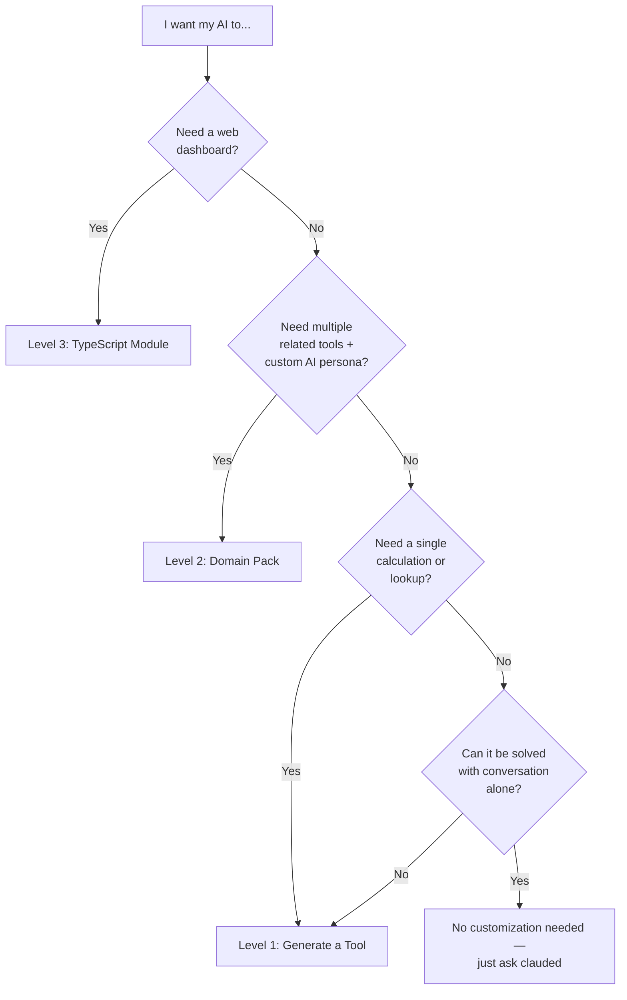

# clauded — Customization Guide

How to extend clauded with domain-specific capabilities for your department. Three levels of customization, from simple (5 minutes, no code) to full TypeScript modules (1-2 days, developer-level).

---

## Table of Contents

1. [Which Level Do I Need?](#which-level-do-i-need)
2. [Level 1: Simple — Generate a Tool](#level-1-simple--generate-a-tool)
3. [Level 2: Medium — Domain Pack](#level-2-medium--domain-pack)
4. [Level 3: Full — TypeScript Module](#level-3-full--typescript-module)
5. [Data Format Templates](#data-format-templates)
6. [Documented Boundaries](#documented-boundaries)
7. [Troubleshooting](#troubleshooting)

---

## Which Level Do I Need?

Use this decision tree to pick the right approach:



| Level | Who | Time | Code? | What You Get |
|-------|-----|------|-------|-------------|
| **1. Simple** | Any user | 5 min | No | Single tool (calculation, lookup, API call) |
| **2. Domain Pack** | Power user | 1-2 hrs | Markdown only | Bundled tools + skills + templates + AI context |
| **3. TypeScript Module** | Developer | 1-2 days | TypeScript | Web dashboard + custom DB + charts + full integration |

### Examples by Department

| Department | Typical Needs | Recommended Level |
|------------|--------------|-------------------|
| **Finance** | NPV calculator, budget variance | Level 1 or 2 |
| **Finance** | Financial dashboard with charts and historical tracking | Level 3 |
| **HR** | Turnover rate, headcount tracker | Level 1 or 2 |
| **HR** | Attrition dashboard with trend analysis | Level 3 |
| **Marketing** | Campaign ROI, lead scoring | Level 1 or 2 |
| **Procurement** | Vendor comparison, PO tracking | Level 1 or 2 |
| **Any department** | Want the AI to understand your domain terminology | Level 2 |
| **Any department** | Interactive visual interface | Level 3 |

---

## Level 1: Simple — Generate a Tool

**For:** Any user who needs a single calculation, lookup, or API integration.
**Time:** 5 minutes.
**Prerequisites:** Access to clauded via Telegram or Matrix.

### What is a Tool?

A tool is a function the AI can call during conversation. When you ask clauded to calculate NPV, it calls the `calculate_npv` tool with your parameters and returns the result. Tools are the building blocks of all clauded capabilities.

### Step-by-Step Procedure

#### Step 1: Generate the tool

Tell clauded what you need in plain English:

```
/tool generate "calculate Net Present Value given a discount rate and a list of annual cash flows"
```

clauded uses AI to create the tool code, define parameters, and register it.

**Expected output:**
```
Tool generated: calculate_npv
Parameters: discount_rate (number), cash_flows (string — comma-separated values)
Status: Registered and ready to use.
```

#### Step 2: Test it

Ask clauded to use the tool naturally:

```
Calculate the NPV with a 10% discount rate and cash flows of -100000, 30000, 35000, 40000, 45000
```

clauded should invoke the `calculate_npv` tool and return the result.

#### Step 3: If it fails — fix it

```
/tool fix calculate_npv
```

clauded analyzes the error and regenerates the code. This can be repeated until the tool works correctly.

#### Step 4: Verify the result

Check the output against a known answer. For NPV at 10% with those cash flows, the result should be approximately $16,273.

#### Step 5: View your tool

```
/tool list          → see all tools including yours
/tool show calculate_npv  → see the tool definition and code
```

### Worked Examples

#### Finance: NPV Calculator

```
/tool generate "calculate Net Present Value. Parameters: discount_rate (number, e.g. 0.10 for 10%), initial_investment (number, negative), cash_flows (string, comma-separated annual cash flows). Formula: NPV = initial_investment + sum(cash_flow_t / (1 + rate)^t)"
```

Test: "What's the NPV of a $500,000 investment with annual returns of $150,000 for 5 years at 8% discount rate?"

#### HR: Employee Turnover Rate

```
/tool generate "calculate employee turnover rate. Parameters: separations (number of employees who left), average_headcount (average number of employees during period). Formula: turnover_rate = (separations / average_headcount) * 100. Return the rate as a percentage with interpretation: under 10% is low, 10-20% is moderate, over 20% is high."
```

Test: "We had 45 separations last quarter with an average headcount of 380. What's our turnover rate?"

#### Marketing: Campaign ROI

```
/tool generate "calculate marketing campaign ROI. Parameters: revenue_generated (number), campaign_cost (number). Formula: ROI = ((revenue - cost) / cost) * 100. Return the ROI percentage and a verdict: negative ROI means loss, 0-100% is modest, 100-500% is strong, over 500% is exceptional."
```

Test: "Our email campaign cost $12,000 and generated $47,000 in revenue. What's the ROI?"

#### Procurement: Vendor Score Comparison

```
/tool generate "compare vendor scores. Parameters: vendors (string, JSON array of objects with fields: name, price, quality, delivery, support — each scored 1-10). Calculate weighted total for each vendor using weights: price 30%, quality 30%, delivery 25%, support 15%. Return ranked list with scores and recommendation."
```

Test: Send a JSON array of 3 vendors with scores and ask for the best option.

### Limitations of Level 1

- **Single tools only** — no bundling of related tools
- **No AI context injection** — the AI doesn't know about your domain terminology unless you explain it each time
- **No templates** — you can't provide starter data files
- **No shared team configuration** — each user generates tools independently
- **No intent detection** — the AI won't proactively suggest your tool unless you ask

**When to upgrade to Level 2:** When you need multiple related tools, want the AI to understand your domain automatically, or want to share a standardized set of tools across a team.

---

## Level 2: Medium — Domain Pack

**For:** Power users who want a coherent set of tools, a specialized AI persona, and data templates for their department.
**Time:** 1-2 hours.
**Prerequisites:** Text editor, basic YAML understanding, access to the server file system (or Docker volume).

### What is a Domain Pack?

A pack is a structured directory containing everything the AI needs to serve a specific department:

```
packs/finance/
  pack.yaml         ← Metadata + capabilities + intent patterns
  tools/            ← Tool definitions (Markdown files)
    calculate-npv.md
    budget-variance.md
  skills/           ← AI persona definitions
    financial-analyst.md
  templates/        ← Example data files
    budget-template.csv
    npv-worksheet.xlsx
  README.md         ← Pack documentation
```

When clauded starts, it automatically loads all packs, registers their tools and skills, and injects their capability descriptions into the AI's system prompt.

### Step-by-Step Procedure

#### Step 1: Scaffold the pack

In Telegram or Matrix:

```
/pack create finance "Financial analysis tools for NPV, budgets, and forecasting"
```

This creates the directory structure with starter files.

**Expected output:**
```
Pack scaffolded: packs/finance/

Next steps:
1. Edit pack.yaml — describe capabilities & intent patterns
2. Add tools in tools/*.md
3. Add skills in skills/*.md
4. Restart clauded or use /reload
5. Verify with /pack info finance
```

#### Step 2: Edit pack.yaml — Capabilities Section

Open `packs/finance/pack.yaml` in a text editor. Update the `capabilities` section:

```yaml
capabilities: |
  ### Finance & Accounting
  You have domain-specific tools for financial analysis:
  - `calculate_npv` tool — Net Present Value with multiple discount rates and sensitivity analysis
  - `budget_variance` tool — Compare actual vs. budgeted spend by department, flag overruns
  - `forecast_revenue` tool — Time-series forecasting with exponential smoothing

  **Key Financial Terminology You Should Use:**
  - NPV = Net Present Value — sum of discounted future cash flows minus initial investment
  - IRR = Internal Rate of Return — discount rate that makes NPV = 0
  - WACC = Weighted Average Cost of Capital — blended cost of debt + equity financing
  - EBITDA = Earnings Before Interest, Taxes, Depreciation, Amortization
  - CapEx = Capital Expenditure — long-term asset purchases
  - OpEx = Operating Expenditure — day-to-day costs

  When users discuss financial topics, use these terms naturally and offer to use the tools when calculations are needed.
```

This text is injected directly into the AI's system prompt. Write it as if you're briefing an analyst on their first day — what should they know, what tools do they have, what terminology matters.

#### Step 3: Edit pack.yaml — Intent Patterns

Intent patterns tell clauded when to suggest your tools. Each pattern is a regex tested against the user's message.

```yaml
intent_patterns:
  - pattern: "\\b(npv|net present value|irr|internal rate|dcf|discounted cash flow|payback period)\\b"
    score_boost: 10
    tools: [calculate_npv]
    web_apps: []
  - pattern: "\\b(budget|variance|actual vs|over.?budget|under.?budget|spending|cost center)\\b"
    score_boost: 10
    tools: [budget_variance]
    web_apps: []
  - pattern: "\\b(forecast|revenue projection|sales forecast|trend|seasonality|predict)\\b"
    score_boost: 10
    tools: [forecast_revenue]
    web_apps: []
```

**Tips for intent patterns:**
- Use `\\b` for word boundaries — type a literal backslash-backslash-b in your editor: `\\b`. The parser converts this to `\b` (regex word boundary) automatically.
- Use `|` for alternatives: `(npv|net present value)`
- `score_boost: 10` is moderate; use `20` for very specific terms
- List the tools that should be suggested when the pattern matches
- Test your regex at [regex101.com](https://regex101.com) — paste the pattern with single `\b` there to verify

#### Step 4: Create a tool — `tools/calculate-npv.md`

Create the file `packs/finance/tools/calculate-npv.md`:

```markdown
---
name: calculate_npv
description: Calculate Net Present Value given discount rate and cash flows
type: generated_code
parameters:
  - name: discount_rate
    type: number
    description: Annual discount rate (e.g., 0.10 for 10%)
    required: true
  - name: initial_investment
    type: number
    description: Initial investment (negative number, e.g., -500000)
    required: true
  - name: cash_flows
    type: string
    description: Comma-separated annual cash flows (e.g., "150000,150000,150000,150000,150000")
    required: true
---
```javascript
const rate = args.discount_rate;
const initial = args.initial_investment;
const flows = args.cash_flows.split(',').map(s => parseFloat(s.trim()));

let npv = initial;
for (let t = 0; t < flows.length; t++) {
  npv += flows[t] / Math.pow(1 + rate, t + 1);
}

const irr_estimate = (() => {
  let low = -0.5, high = 5.0;
  for (let i = 0; i < 100; i++) {
    const mid = (low + high) / 2;
    let val = initial;
    for (let t = 0; t < flows.length; t++) val += flows[t] / Math.pow(1 + mid, t + 1);
    if (val > 0) low = mid; else high = mid;
  }
  return (low + high) / 2;
})();

const payback = (() => {
  let cumulative = initial;
  for (let t = 0; t < flows.length; t++) {
    cumulative += flows[t];
    if (cumulative >= 0) return t + 1;
  }
  return null;
})();

return {
  npv: Math.round(npv * 100) / 100,
  irr: Math.round(irr_estimate * 10000) / 100 + '%',
  payback_years: payback || 'Not recovered within projection period',
  recommendation: npv > 0 ? 'INVEST — positive NPV' : 'REJECT — negative NPV',
  discount_rate: (rate * 100) + '%',
  total_cash_flows: flows.reduce((a, b) => a + b, 0),
  periods: flows.length
};
```
```

**Tool format explained:**
- `---` YAML frontmatter with name, description, type, parameters
- `---` then the code body (JavaScript)
- Available variables: `args` (parameter values), `fetch()` (HTTP client)
- Return a JSON object with your results
- Types for parameters: `string`, `number`, `boolean`

#### Step 5: Create a skill — `skills/financial-analyst.md`

```markdown
---
name: financial_analyst
description: Expert financial analyst persona for investment analysis and budgeting
tools: [calculate_npv, budget_variance, forecast_revenue]
---
You are a senior financial analyst with deep expertise in corporate finance, investment analysis, and budgeting. Your approach:

1. Always ask for the discount rate / WACC before running NPV calculations
2. Present results with clear recommendations (INVEST / HOLD / REJECT)
3. Flag assumptions: "This assumes constant cash flows — real projections should account for growth/decline"
4. Compare scenarios: run multiple discount rates to show sensitivity
5. Use standard financial terminology and format currency properly
6. When analyzing budgets, look for: variances > 10%, recurring overruns, seasonal patterns

If the user provides data in a file (CSV, XLSX), parse it first and use the values in your calculations.
```

#### Step 6: Add data templates

Create `packs/finance/templates/budget-template.csv`:

```csv
Department,Category,Budgeted,Actual,Period
Engineering,Salaries,500000,510000,Q1 2026
Engineering,Software,50000,48000,Q1 2026
Engineering,Hardware,30000,42000,Q1 2026
Marketing,Advertising,200000,180000,Q1 2026
Marketing,Events,75000,92000,Q1 2026
Operations,Facilities,150000,155000,Q1 2026
Operations,Utilities,25000,24000,Q1 2026
```

Users can request templates with `/pack templates finance` and the bot will send the file.

#### Step 7: Restart clauded

```bash
docker compose restart clauded
```

**Important:** You must restart clauded after any pack changes — this includes new tools, new skills, and pack.yaml edits. Pack discovery and import only happens at startup. The `/reload` command refreshes tools already in the database but does not scan for new pack files.

#### Step 8: Verify — pack is loaded

```
/pack list
```

**Expected output:**
```
Domain Packs (1)

Finance & Accounting (finance v0.1.0)
  Financial analysis tools for NPV, budgets, and forecasting
  Tools: 1 | Skills: 1 | Templates: 1
```

```
/pack info finance
```

**Expected output:**
```
Finance & Accounting (v0.1.0)
Description: Financial analysis tools for NPV, budgets, and forecasting

Tools (1):
(registered in tool registry)

Skills (1):
(registered in skill list)

Templates (1):
  • budget-template.csv

Intent Patterns: 3
Pack Commands: (none)
```

#### Step 9: Test intent scoring

Send a message that should trigger your intent patterns:

```
I need to calculate the NPV for a new equipment purchase
```

clauded should recognize this as a finance domain request and suggest using the `calculate_npv` tool.

#### Step 10: Test tool execution

```
Calculate NPV with 8% discount rate, $200,000 investment, and cash flows of 50000, 60000, 70000, 80000, 90000
```

Verify the result is correct (NPV should be approximately $82,390).

#### Step 11: Iterate and refine

- Add more tools as needed
- Refine intent patterns based on what users actually say
- Update the capabilities prompt with new terminology and guidance
- Test edge cases (missing parameters, invalid input)

#### Step 12: Share with your team

To share the pack:

1. Zip the `packs/finance/` directory
2. Have teammates extract it into their clauded `packs/` directory
3. Restart their clauded instance
4. Verify with `/pack list`

For organization-wide distribution, put the pack in a shared git repository.

### Complete Department Examples

#### HR Pack — `packs/hr/pack.yaml`

```yaml
name: hr
display_name: "Human Resources"
description: "HR analytics — turnover, headcount, compensation benchmarking"
version: "0.1.0"
author: "HR Team"
enabled: true

capabilities: |
  ### Human Resources Analytics
  You have domain-specific tools for HR analysis:
  - `turnover_analysis` tool — Calculate turnover rates by department, identify trends
  - `headcount_forecast` tool — Project headcount needs based on growth plans and historical attrition
  - `compensation_benchmark` tool — Compare salary ranges against market data

  **Key HR Terminology:**
  - Voluntary turnover = employees who chose to leave
  - Involuntary turnover = employees who were terminated
  - Regrettable attrition = high-performers who left voluntarily
  - Span of control = number of direct reports per manager
  - FTE = Full-Time Equivalent
  - eNPS = Employee Net Promoter Score

self_description: |
  **Human Resources** — 3 domain tools:
  • Turnover analysis with department breakdown and trend detection
  • Headcount forecasting with growth and attrition modeling
  • Compensation benchmarking against market data

intent_patterns:
  - pattern: "\\b(turnover|attrition|retention|churn|leaving|resignation|quit rate|exit)\\b"
    score_boost: 10
    tools: [turnover_analysis]
    web_apps: []
  - pattern: "\\b(headcount|workforce plan|hiring plan|fte|full.?time|staffing|recruit)\\b"
    score_boost: 10
    tools: [headcount_forecast]
    web_apps: []
  - pattern: "\\b(salary|compensation|pay band|market rate|benchmark|equity|merit)\\b"
    score_boost: 10
    tools: [compensation_benchmark]
    web_apps: []

commands: []
```

#### Marketing Pack — `packs/marketing/pack.yaml`

```yaml
name: marketing
display_name: "Marketing Analytics"
description: "Campaign performance, lead scoring, and content planning"
version: "0.1.0"
author: "Marketing Team"
enabled: true

capabilities: |
  ### Marketing Analytics
  You have domain-specific tools for marketing analysis:
  - `campaign_roi` tool — Calculate return on investment for marketing campaigns
  - `lead_scorer` tool — Score leads based on engagement signals and demographics
  - `content_calendar` tool — Generate content calendars with optimal posting times

  **Key Marketing Terminology:**
  - CAC = Customer Acquisition Cost
  - LTV = Lifetime Value (also CLV = Customer Lifetime Value)
  - MQL = Marketing Qualified Lead
  - SQL = Sales Qualified Lead
  - CTR = Click-Through Rate
  - CPC = Cost Per Click
  - ROAS = Return on Ad Spend

self_description: |
  **Marketing Analytics** — 3 domain tools:
  • Campaign ROI calculator with channel comparison
  • Lead scoring with engagement weighting
  • Content calendar generator with optimal timing

intent_patterns:
  - pattern: "\\b(campaign|roi|roas|return on ad|ad spend|marketing budget|cpc|ctr|cost per)\\b"
    score_boost: 10
    tools: [campaign_roi]
    web_apps: []
  - pattern: "\\b(lead scor|mql|sql|qualified lead|prospect|funnel|conversion rate|pipeline)\\b"
    score_boost: 10
    tools: [lead_scorer]
    web_apps: []
  - pattern: "\\b(content calendar|posting schedule|editorial|content plan|blog schedule|social media plan)\\b"
    score_boost: 10
    tools: [content_calendar]
    web_apps: []

commands: []
```

#### Procurement Pack — `packs/procurement/pack.yaml`

```yaml
name: procurement
display_name: "Procurement & Supply Chain"
description: "Vendor evaluation, purchase order tracking, and spend analysis"
version: "0.1.0"
author: "Procurement Team"
enabled: true

capabilities: |
  ### Procurement & Supply Chain
  You have domain-specific tools for procurement analysis:
  - `vendor_scorecard` tool — Evaluate vendors on price, quality, delivery, and support
  - `spend_analyzer` tool — Categorize and analyze purchasing spend by vendor, category, and period
  - `po_tracker` tool — Track purchase order status and flag overdue deliveries

  **Key Procurement Terminology:**
  - RFQ = Request for Quotation
  - RFP = Request for Proposal
  - PO = Purchase Order
  - MOQ = Minimum Order Quantity
  - Lead time = time from order placement to delivery
  - Maverick spend = purchases outside approved contracts
  - TCO = Total Cost of Ownership (includes hidden costs)

self_description: |
  **Procurement** — 3 domain tools:
  • Vendor scorecard with weighted criteria evaluation
  • Spend analysis by vendor, category, and period
  • PO tracking with overdue delivery alerts

intent_patterns:
  - pattern: "\\b(vendor|supplier|scorecard|rfq|rfp|sourcing|bid|quote|tender)\\b"
    score_boost: 10
    tools: [vendor_scorecard]
    web_apps: []
  - pattern: "\\b(spend analysis|purchasing|procurement|buying|category spend|maverick)\\b"
    score_boost: 10
    tools: [spend_analyzer]
    web_apps: []
  - pattern: "\\b(purchase order|po track|po status|overdue delivery|delivery date|lead time)\\b"
    score_boost: 10
    tools: [po_tracker]
    web_apps: []

commands: []
```

### Tool Types Explained

#### `generated_code` — JavaScript Logic

For calculations, data processing, or any logic that runs locally.

```markdown
---
name: my_tool
type: generated_code
parameters:
  - name: input
    type: string
    required: true
---
// Your JavaScript code here
return { result: args.input.toUpperCase() };
```

**Available in code:**
- `args` — parameter values (e.g., `args.input`)
- `fetch()` — HTTP client for external APIs
- Standard JavaScript (Math, Date, JSON, String, Array methods)

**Not available:** `process`, `fs`, `require`, `eval`, `import()`

#### `declarative_http` — API Endpoint

For tools that call an external REST API without writing code.

```markdown
---
name: weather_lookup
type: declarative_http
description: Get current weather for a city
parameters:
  - name: city
    type: string
    required: true
endpoint:
  method: GET
  url: "https://api.example.com/weather"
  query:
    q: "{{ args.city }}"
    units: "metric"
  headers:
    Authorization: "Bearer {{ env.WEATHER_API_KEY }}"
  response_path: "data.current"
---
```

Use `{{ args.paramName }}` to inject parameters and `{{ env.VAR_NAME }}` for environment variables.

### Debugging Guide

| Problem | Check |
|---------|-------|
| Pack not showing in `/pack list` | Is `pack.yaml` present? Is `enabled: true`? Check Docker logs. |
| Tool not registered | Is the `.md` file in `tools/`? Run `/reload`. Check for parse errors in logs. |
| Intent not triggering | Test your regex at regex101.com. Ensure double-escaping (`\\b` not `\b`) in YAML. |
| Tool returns error | Check tool code syntax. Test with simple inputs first. Use `/tool fix <name>`. |
| Capabilities not in system prompt | Capabilities require restart, not just `/reload`. Check `docker compose logs clauded`. |
| Safety scanner rejects tool | Your code uses blocked patterns (eval, process, fs). Rewrite without them. |

---

## Level 3: Full — TypeScript Module

**For:** Developers who need interactive web dashboards, custom database tables, chart rendering, or deep integration with the existing system.
**Time:** 1-2 days for a basic module; longer for complex dashboards.
**Prerequisites:** TypeScript, Node.js, understanding of the clauded architecture (see `docs/architecture.md`).

### When You Need Level 3

- You want an **interactive web dashboard** (like `/sim`, `/capacity`, `/vsm`)
- You need **custom database tables** for historical data storage
- You want **chart rendering** (bar, line, pie charts embedded in documents)
- You need **complex multi-step calculations** that don't fit in a single tool
- You want **WebSocket** or real-time features

### Architecture Reference

Every existing manufacturing module follows the same pattern. Use the simulation module (`src/simulation/`) as your reference:

```
src/<domain>/
├── models.ts        ← TypeScript types and interfaces
├── analysis.ts      ← Core calculation engine (pure functions)
├── index.ts         ← DB tables, CRUD operations, chart generation
└── (optional)
    ├── monte-carlo.ts   ← Stochastic simulation
    ├── scenarios.ts     ← What-if scenarios
    └── roi.ts           ← Investment analysis

src/providers/tools/<domain>.ts   ← AI tool binding
src/web/<domain>-api.ts           ← HTTP API handlers
src/web/public/<domain>/index.html ← Web SPA (Vue 3 + Vuetify CDN)
```

### Step-by-Step Procedure

#### Step 1: Create the engine

Create `src/finance/models.ts`:

```typescript
// Types for your domain
export interface InvestmentAnalysis {
  npv: number;
  irr: number;
  paybackYears: number | null;
  discountRate: number;
  cashFlows: number[];
}

export interface BudgetLine {
  department: string;
  category: string;
  budgeted: number;
  actual: number;
  period: string;
}

export interface BudgetVarianceReport {
  lines: Array<BudgetLine & { variance: number; variancePct: number }>;
  totalBudgeted: number;
  totalActual: number;
  totalVariance: number;
  overruns: string[];
}
```

Create `src/finance/analysis.ts`:

```typescript
import type { InvestmentAnalysis, BudgetLine, BudgetVarianceReport } from './models.js';

export function calculateNPV(
  discountRate: number,
  initialInvestment: number,
  cashFlows: number[],
): InvestmentAnalysis {
  let npv = initialInvestment;
  for (let t = 0; t < cashFlows.length; t++) {
    npv += cashFlows[t] / Math.pow(1 + discountRate, t + 1);
  }

  // IRR via bisection
  let low = -0.5, high = 5.0;
  for (let i = 0; i < 100; i++) {
    const mid = (low + high) / 2;
    let val = initialInvestment;
    for (let t = 0; t < cashFlows.length; t++) {
      val += cashFlows[t] / Math.pow(1 + mid, t + 1);
    }
    if (val > 0) low = mid; else high = mid;
  }

  // Payback
  let cumulative = initialInvestment;
  let payback: number | null = null;
  for (let t = 0; t < cashFlows.length; t++) {
    cumulative += cashFlows[t];
    if (cumulative >= 0) { payback = t + 1; break; }
  }

  return {
    npv: Math.round(npv * 100) / 100,
    irr: Math.round(((low + high) / 2) * 10000) / 100,
    paybackYears: payback,
    discountRate,
    cashFlows,
  };
}

export function analyzeBudgetVariance(lines: BudgetLine[]): BudgetVarianceReport {
  const analyzed = lines.map((line) => ({
    ...line,
    variance: line.actual - line.budgeted,
    variancePct: line.budgeted !== 0
      ? Math.round(((line.actual - line.budgeted) / line.budgeted) * 10000) / 100
      : 0,
  }));

  const totalBudgeted = lines.reduce((s, l) => s + l.budgeted, 0);
  const totalActual = lines.reduce((s, l) => s + l.actual, 0);
  const overruns = analyzed
    .filter((l) => l.variancePct > 10)
    .map((l) => `${l.department}/${l.category}: ${l.variancePct}% over budget`);

  return {
    lines: analyzed,
    totalBudgeted,
    totalActual,
    totalVariance: totalActual - totalBudgeted,
    overruns,
  };
}
```

Create `src/finance/index.ts` — DB tables and CRUD:

```typescript
import { getDb } from '../db.js';
import { calculateNPV, analyzeBudgetVariance } from './analysis.js';

// Re-export analysis functions
export { calculateNPV, analyzeBudgetVariance };
export type { InvestmentAnalysis, BudgetLine, BudgetVarianceReport } from './models.js';

// Initialize DB tables (called from initDatabase or startup)
export function initFinanceTables(): void {
  const db = getDb();
  db.exec(`
    CREATE TABLE IF NOT EXISTS finance_analyses (
      id INTEGER PRIMARY KEY AUTOINCREMENT,
      chat_id TEXT NOT NULL,
      type TEXT NOT NULL,
      input TEXT NOT NULL,
      result TEXT NOT NULL,
      created_at INTEGER NOT NULL DEFAULT (unixepoch())
    )
  `);
}

// Save analysis result
export function saveAnalysis(chatId: string, type: string, input: unknown, result: unknown): void {
  const db = getDb();
  db.prepare(
    'INSERT INTO finance_analyses (chat_id, type, input, result) VALUES (?, ?, ?, ?)',
  ).run(chatId, type, JSON.stringify(input), JSON.stringify(result));
}
```

#### Step 2: Create the web API — `src/web/finance-api.ts`

```typescript
import type { IncomingMessage, ServerResponse } from 'node:http';
import { calculateNPV, analyzeBudgetVariance } from '../finance/index.js';

export async function handleFinanceApi(
  req: IncomingMessage,
  res: ServerResponse,
  urlPath: string,
): Promise<void> {
  // Parse request body for POST
  const body = req.method === 'POST' ? await parseBody(req) : {};

  if (urlPath === '/api/finance/npv' && req.method === 'POST') {
    const result = calculateNPV(body.discountRate, body.initialInvestment, body.cashFlows);
    res.writeHead(200, { 'Content-Type': 'application/json' });
    res.end(JSON.stringify(result));
    return;
  }

  if (urlPath === '/api/finance/variance' && req.method === 'POST') {
    const result = analyzeBudgetVariance(body.lines);
    res.writeHead(200, { 'Content-Type': 'application/json' });
    res.end(JSON.stringify(result));
    return;
  }

  // Info endpoint
  res.writeHead(200, { 'Content-Type': 'application/json' });
  res.end(JSON.stringify({ module: 'finance', version: '0.1.0', endpoints: ['/api/finance/npv', '/api/finance/variance'] }));
}

function parseBody(req: IncomingMessage): Promise<Record<string, unknown>> {
  return new Promise((resolve) => {
    const chunks: Buffer[] = [];
    req.on('data', (chunk) => chunks.push(chunk));
    req.on('end', () => {
      try { resolve(JSON.parse(Buffer.concat(chunks).toString())); }
      catch { resolve({}); }
    });
  });
}
```

#### Step 3: Create the tool binding — `src/providers/tools/finance.ts`

```typescript
import type { ToolEntry } from '../../forge/tool-registry.js';
import { calculateNPV, analyzeBudgetVariance } from '../../finance/index.js';

export function getFinanceTools(): ToolEntry[] {
  return [
    {
      definition: {
        type: 'function',
        function: {
          name: 'finance_npv',
          description: 'Calculate NPV, IRR, and payback period for an investment',
          parameters: {
            type: 'object',
            properties: {
              discount_rate: { type: 'number', description: 'Annual discount rate (e.g., 0.10 for 10%)' },
              initial_investment: { type: 'number', description: 'Initial investment (negative number)' },
              cash_flows: { type: 'string', description: 'Comma-separated annual cash flows' },
            },
            required: ['discount_rate', 'initial_investment', 'cash_flows'],
          },
        },
      },
      execute: async (args) => {
        const flows = String(args.cash_flows).split(',').map((s) => parseFloat(s.trim()));
        return calculateNPV(Number(args.discount_rate), Number(args.initial_investment), flows);
      },
      source: 'builtin',
    },
  ];
}
```

#### Step 4: Create the web UI — `src/web/public/finance/index.html`

Follow the pattern of existing SPAs (e.g., `src/web/public/capacity/index.html`):
- Vue 3 + Vuetify loaded from CDN
- Fetch data from `/api/finance/*` endpoints
- Include input forms, result tables, and charts (Chart.js CDN)

#### Step 5: Register the API route in `src/web/server.ts`

Add to the API routing chain:

```typescript
} else if (urlPath.startsWith('/api/finance')) {
  handleFinanceApi(req, res, urlPath).catch(/* ... */);
```

And add the SPA route:

```typescript
} else if (urlPath === '/finance' || urlPath === '/finance/') {
  filePath = resolve(PUBLIC_DIR, 'finance', 'index.html');
```

#### Step 6: Register the tool in `src/providers/tools/index.ts`

```typescript
import { getFinanceTools } from './finance.js';

// In registerBuiltinTools():
for (const tool of getFinanceTools()) {
  registerTool(tool);
}
```

#### Step 7: Add to CAPABILITIES_PROMPT in `src/capabilities.ts`

Add your domain description to the `CAPABILITIES_PROMPT` string.

#### Step 8: Add intent patterns to `scoreMfgIntent()` in `src/capabilities.ts`

```typescript
// Finance
if (/\b(npv|irr|budget variance|financial analysis|cash flow|discount rate|payback)\b/i.test(lower)) {
  score += 10;
  tools.push('finance_npv');
  webApps.push('/finance');
}
```

#### Step 9: Add bot command in `src/platforms/telegram.ts` and `matrix.ts`

```typescript
bot.command('finance', async (ctx) => {
  // Handle finance-specific commands
});
```

#### Step 10: Write tests

Create `tests/finance.test.ts`:

```typescript
import { describe, it, expect } from 'vitest';
import { calculateNPV, analyzeBudgetVariance } from '../src/finance/analysis.js';

describe('Finance', () => {
  it('calculates NPV correctly', () => {
    const result = calculateNPV(0.10, -100000, [30000, 35000, 40000, 45000]);
    expect(result.npv).toBeCloseTo(16273, -1);
    expect(result.paybackYears).toBe(3);
  });

  it('detects budget overruns', () => {
    const result = analyzeBudgetVariance([
      { department: 'Eng', category: 'HW', budgeted: 30000, actual: 42000, period: 'Q1' },
    ]);
    expect(result.overruns).toHaveLength(1);
    expect(result.overruns[0]).toContain('40%');
  });
});
```

#### Step 11: Build and test

```bash
npm run build
npm test
```

#### Step 12: Deploy

```bash
docker compose up -d --build
```

### Reference: Existing Module Architecture

Use these as templates when building your own module:

| Module | Engine | API | Tool | Web UI | Tests |
|--------|--------|-----|------|--------|-------|
| Simulation | `src/simulation/` | `src/web/sim-api.ts` | `src/providers/tools/simulation.ts` | `src/web/public/simulation/` | `tests/simulation-*.test.ts` |
| Capacity | `src/capacity/` | `src/web/capacity-api.ts` | `src/providers/tools/capacity.ts` | `src/web/public/capacity/` | `tests/capacity-*.test.ts` |
| Sequencer | `src/sequencer/` | `src/web/sequencer-api.ts` | `src/providers/tools/sequencer.ts` | `src/web/public/sequencer/` | `tests/sequencer-*.test.ts` |
| Six Sigma | `src/sigma.ts` | — | `src/providers/tools/sigma.ts` | — | `tests/sigma.test.ts` |
| FMEA | `src/fmea.ts` | — | `src/providers/tools/fmea.ts` | — | `tests/fmea.test.ts` |

### DB Migration Patterns

- **Always additive** — create new tables, never modify existing ones
- Use `CREATE TABLE IF NOT EXISTS` — safe for repeated runs
- Initialize tables from your module's `index.ts` or call during `initDatabase()`
- Use `INTEGER PRIMARY KEY AUTOINCREMENT` for IDs
- Store JSON as `TEXT` columns
- Add `chat_id TEXT NOT NULL` to scope data per user
- Add `created_at INTEGER NOT NULL DEFAULT (unixepoch())` for timestamps

---

## Data Format Templates

### How Templates Work

Packs can include example data files in their `templates/` directory. Users request them via `/pack templates <name>` and the bot sends the files.

### Recommended Formats

| Format | Best For |
|--------|---------|
| **CSV** | Simple tabular data — budget lines, employee lists, product catalogs |
| **XLSX** | Multi-sheet data with headers — financial reports, vendor evaluations |

### Template Design Tips

1. **Include headers** — the AI reads column names to understand the data
2. **Include 5-10 example rows** — enough to show the pattern, not so many they're overwhelming
3. **Use realistic data** — placeholder values that make sense for the domain
4. **Add a "Notes" column if needed** — for data entry instructions
5. **Name files descriptively** — `budget-template.csv` not `template1.csv`

---

## Documented Boundaries

These are things the platform does NOT currently support. Each boundary includes what to do instead.

### No Dynamic Web Route Registration for Packs

**What it means:** Domain Packs (Level 2) cannot add new web dashboards. The web server's routes are defined in TypeScript.

**Why:** Web route registration requires server restart and has security implications (untrusted code serving HTTP responses). The current architecture prioritizes simplicity and safety.

**What to do instead:** If you need an interactive web dashboard, follow Level 3 (TypeScript Module) — specifically Steps 4-5 (create web UI and register routes). The step-by-step procedure above walks you through the entire process.

### No Pack Dependency System

**What it means:** Each pack is self-contained. You cannot declare "this pack requires the HR pack."

**Why:** Dependencies add complexity (version conflicts, load ordering, cascading failures) that isn't justified for a personal/department assistant.

**What to do instead:** If your pack needs data from another department, share data via templates or memory — not pack-to-pack imports. For shared utilities (e.g., a currency converter used by both Finance and Procurement), put the common tool in `forge/tools/` where it's available to everyone.

### No Remote Pack Repository

**What it means:** There is no `pack install <url>` command. Packs are local directories.

**Why:** Keeps the system simple and avoids supply chain security risks.

**What to do instead:** To share a pack with another team, zip the `packs/<name>/` directory and have them extract it into their `packs/` directory. For organization-wide distribution, put packs in a shared git repository or internal file share that teams can clone or sync from.

### No Hot-Reload of Packs

**What it means:** After any pack change — new tools, new skills, or pack.yaml edits — you must restart clauded.

**Why:** Pack discovery, tool/skill import, and capability injection all happen at startup. Changing them at runtime would require complex state management with potential consistency issues.

**What to do instead:** Restart with `docker compose restart clauded` (takes about 10 seconds). The `/reload` command only refreshes tools already in the database — it does not scan packs for new files.

### No Pack-Level Permissions

**What it means:** All loaded packs are accessible to all authorized users. You cannot restrict "only Finance team members can use Finance tools."

**Why:** clauded is a personal assistant — authentication is at the platform level (Telegram chat ID, Matrix user ID), not at the pack level.

**What to do instead:** If you need per-department access control, run separate clauded instances with different `.env` configurations and different `packs/` directories. Each instance serves one department's bot with only their domain packs.

### No Pack-Specific Database Tables

**What it means:** Level 2 pack tools use the existing tool infrastructure for data storage. They cannot create custom database tables.

**Why:** Schema modifications require TypeScript code and database migration logic that goes beyond what markdown tool definitions can express.

**What to do instead:** For simple data persistence, tools can use the `save_memory` tool or write to files in the workspace directory. For proper database tables with queries and historical tracking, follow Level 3 (TypeScript Module) — specifically Step 1 (create engine with DB tables).

### No GUI Pack Editor

**What it means:** There is no web-based interface for creating or editing packs. Packs are created via the `/pack create` command and edited with a text editor.

**Why:** A GUI editor would be a significant development effort with limited benefit — pack.yaml is a simple format that's easy to edit in any text editor.

**What to do instead:** Use `/pack create <name> "description"` to scaffold the directory with a fully commented template. Edit the generated `pack.yaml` and tool files with any text editor. The comments in the scaffolded files explain every field.

---

## Troubleshooting

### Common Issues

| Symptom | Likely Cause | Fix |
|---------|-------------|-----|
| `/pack list` shows empty | Pack not in `packs/` directory | Check `packs/<name>/pack.yaml` exists |
| Pack loads but tools don't work | Tool `.md` file has syntax error | Check logs: `docker compose logs clauded \| grep "pack"` |
| Intent patterns don't trigger | Regex syntax error in YAML | Double-escape backslashes: `\\b` not `\b`. Test at regex101.com |
| "Pack already exists" on create | Directory already present | Delete or rename the existing directory |
| Tool rejected by safety scanner | Code uses blocked patterns | Remove: eval, process, fs, require, exec. Use fetch() for HTTP |
| Capabilities not appearing | Didn't restart after pack.yaml change | `docker compose restart clauded` |
| TypeScript build errors (Level 3) | Missing imports or type errors | Run `npx tsc --noEmit` to see errors |

### Reading Logs

```bash
# Pack loading messages
docker compose logs clauded | grep -i pack

# Tool import messages
docker compose logs clauded | grep -i "imported\|skipping\|failed"

# Intent scoring (enable debug level)
# Set LOG_LEVEL=debug in .env, restart, then check logs
```

### Getting Help

1. Check this guide's worked examples for your department
2. Check `docs/architecture.md` for system internals
3. Check `docs/commands.md` for all available commands
4. Ask clauded: "How do I create a tool that calculates X?" — it knows its own capabilities
